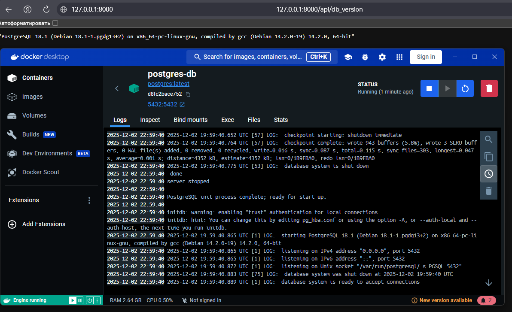
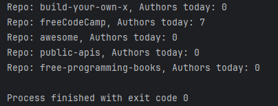
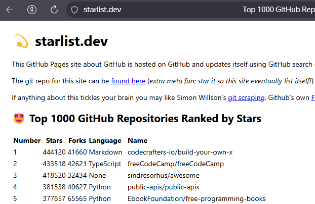
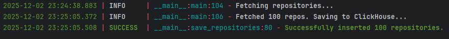
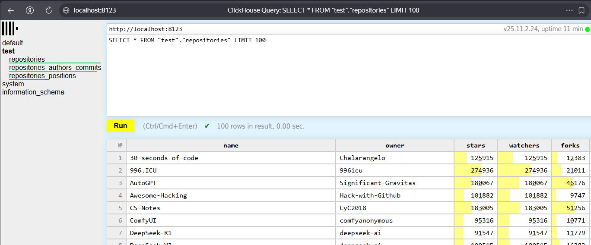
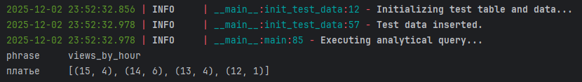

# Отчёт

## 1 задание

Подключение к БД установлено:

## 2 задание

Вывод топ-5 репозиториев по кол-ву звёзд:

Полученный результат совпадает с аналогичным сервисом в интернете:

## 3 задание

Вывод программы:

Проверка с помощью веб-интерфейса:

## 4 задание

Вывод программы:

